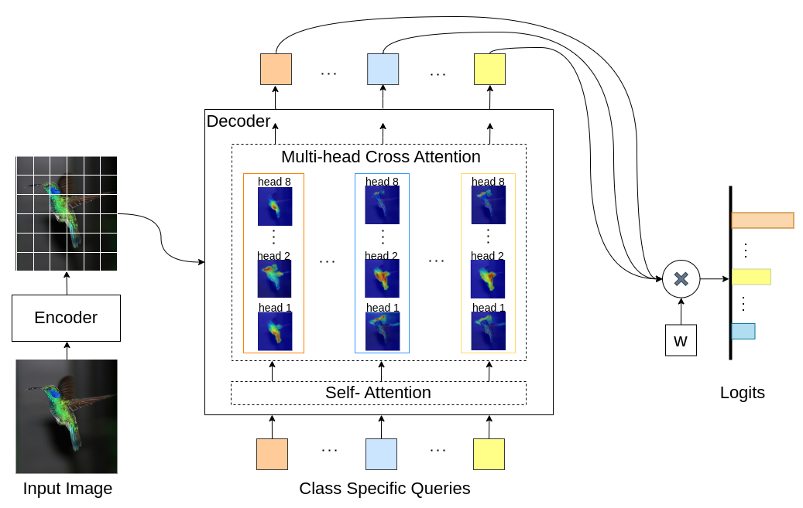
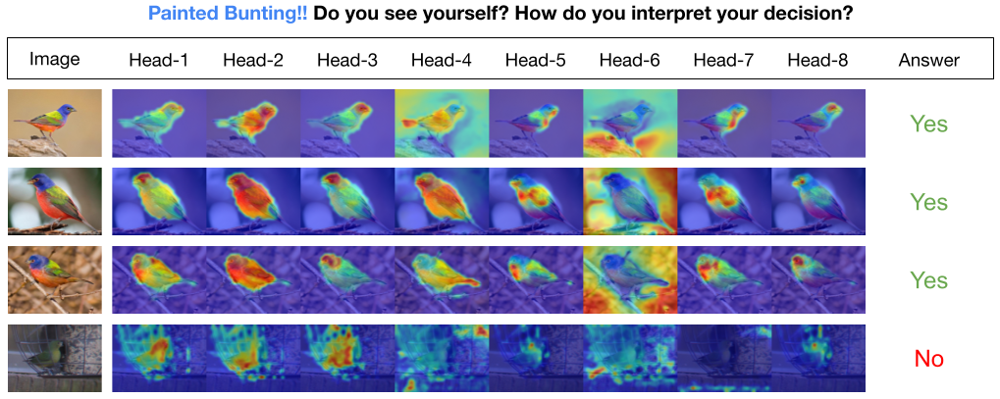

# INTR: A Simple Interpretable Transformer for Fine-grained Image Classification and Analysis

This repo is the official implementation of [INTR: A Simple Interpretable Transformer for Fine-grained Image Classification and Analysis](https://arxiv.org/pdf/2311.04157.pdf). It currently includes code and models for the interpretation of fine-grained data. <br>


INTR is a novel usage of Transformers to make image classification interpretable. In INTR, we investigate a proactive approach to classification, asking each class to look for itself in an image. We learn class-specific queries (one for each class) as input to the decoder, allowing them to look for their presence in an image via cross-attention.  We show that INTR intrinsically encourages each class to attend distinctly; the cross-attention weights thus provide a meaningful interpretation of the model's prediction. Interestingly, via multi-head cross-attention, INTR could learn to localize different attributes of a class, making it particularly suitable for fine-grained classification and analysis.



In the INTR model, each query in the decoder is responsible for the prediction of a class. So, a query looks at itself to find class-specific features from the feature map. First, we visualize the feature map i.e., the value matrix of the transformer architecture to see the important parts of the object in the image. To find the specific features, where the model pays attention in the value matrix, we show the heatmap of the attention of the model. To avoid external interference in the classification, we use a shared weight vector for classification so therefore the attention weight explains the model's prediction.



## Fine-tune models and results

INTR on [DETR-R50](https://github.com/facebookresearch/detr) backbone, classification performance, and fine-tuned models on different datasets.


| Dataset | acc@1 | acc@5 | Model |
|----------|----------|----------|----------|
| [CUB](https://www.vision.caltech.edu/datasets/cub_200_2011/) | 71.8 | 89.3 |  [checkpoint](https://huggingface.co/imageomics/INTR/resolve/main/intr_checkpoint_cub_detr_r50.pth)|
| [Bird](https://www.kaggle.com/datasets/gpiosenka/100-bird-species) | 97.4 | 99.2 |  [checkpoint](https://huggingface.co/imageomics/INTR/resolve/main/intr_checkpoint_bird_detr_r50.pth)|
| [Butterfly](https://huggingface.co/datasets/imageomics/Cambridge_butterfly/resolve/main/butterfly.zip?download=true) | 95.0 | 98.3 |  [checkpoint](https://huggingface.co/imageomics/INTR/resolve/main/intr_checkpoint_butterfly_detr_r50.pth?download=true)|


## Installation Instructions

Create python environment (optional)
```sh
conda create -n intr python=3.8 -y
conda activate intr
```

Clone the repository
```sh
git clone https://github.com/dipanjyoti/INTR.git
cd INTR
```

Install python dependencies

```sh
pip install -r requirements.txt
```

## Data Preparation
Follow the below format for data.
```
datasets
├── dataset_name
│   ├── train
│   │   ├── class1
│   │   │   ├── img1.jpeg
│   │   │   ├── img2.jpeg
│   │   │   └── ...
│   │   ├── class2
│   │   │   ├── img3.jpeg
│   │   │   └── ...
│   │   └── ...
│   └── val
│       ├── class1
│       │   ├── img4.jpeg
│       │   ├── img5.jpeg
│       │   └── ...
│       ├── class2
│       │   ├── img6.jpeg
│       │   └── ...
│       └── ...
```

## INTR Evaluation
To evaluate the performance of INTR on the _CUB_ dataset, on a multi-GPU (e.g., 4 GPUs) settings, execute the below command. INTR checkpoints are available at Fine-tune model and results.

```sh
CUDA_VISIBLE_DEVICES=0,1,2,3 python -m torch.distributed.launch --nproc_per_node=4 --master_port 12345 --use_env main.py --eval --resume <path/to/intr_checkpoint_cub_detr_r50.pth> --dataset_path <path/to/datasets> --dataset_name <dataset_name> 
```
## INTR Interpretation

To generate visual representations of the INTR's interpretations, execute the provided command below. This command will present the interpretation for a specific class with the index <class_number>. By default, it will display interpretations from all attention heads. To focus on interpretations associated with the top queries labeled as top_q as well, set the parameter sim_query_heads to 1. Use a batch size of 1 for the visualization.

```sh
python -m tools.visualization --eval --resume <path/to/intr_checkpoint_cub_detr_r50.pth> --dataset_path <path/to/datasets> --dataset_name <dataset_name> --class_index <class_number>
```
## INTR Training
To prepare INTR for training, use the pretrained model [DETR-R50](https://github.com/facebookresearch/detr). To train for a particular dataset, modify '--num_queries' by setting it to the number of classes in the dataset. Within the INTR architecture, each query in the decoder is assigned the task of capturing class-specific features, which means that every query can be adapted through the learning process. Consequently, the total number of model parameters will grow in proportion to the number of classes in the dataset. To train INTR on a multi-GPU system, (e.g., 4 GPUs), execute the command below.

```sh
CUDA_VISIBLE_DEVICES=0,1,2,3 python -m torch.distributed.launch --nproc_per_node=4 --master_port 12345 --use_env main.py --finetune <path/to/detr-r50-e632da11.pth> --dataset_path <path/to/datasets> --dataset_name <dataset_name> --num_queries <num_of_classes>
```
## Acknowledgment
Our model is inspired by the DEtection TRansformer [(DETR)](https://github.com/facebookresearch/detr) method.

We thank the authors of DETR for doing such great work.

[](https://doi.org/10.48550/arXiv.2311.04157)


## Bibtext
If you find our work helpful for your research, please consider citing the BibTeX entry.
```sh
... to be added ...
```
